Of course. Here is the updated documentation with your requested additions.

## AI-Powered Medical Report Simplifier

☁️ **Live Demo URL**: [https://medical-report-simplifier-latest.onrender.com/](https://medical-report-simplifier-latest.onrender.com/)

Demonstration Video Link : https://drive.google.com/file/d/1L7M5Ki7h3oRoSpSA6eknfIok8R29bIT0/view?usp=drive_link

A FastAPI service that extracts, normalizes, guardrails, and summarizes medical lab reports from images or raw text using Tesseract OCR and Google Gemini.

### Key Features

  - **OCR extraction**: Read text from uploaded images via Tesseract.
  - **LLM parsing**: Extract raw test strings from report text.
  - **Normalization**: Convert to structured JSON with values, units, status, reference ranges.
  - **Guardrails**: Detect hallucinated/unsupported tests with exact + fuzzy matching.
  - **Summarization**: Patient-friendly summary and explanations without medical advice.

-----

## Setup

### Prerequisites

  - Python 3.10+
  - Tesseract OCR installed and on PATH
      - Windows: Install from `https://github.com/UB-Mannheim/tesseract/wiki` and ensure `tesseract.exe` is in PATH
      - macOS: `brew install tesseract`
      - Linux (Debian/Ubuntu): `sudo apt-get update && sudo apt-get install -y tesseract-ocr`
  - Google Generative AI API key (Gemini)

### 1\) Clone and enter project

```bash
git clone <your-fork-or-path>
cd "plum_project_final - Copy"
```

### 2\) Create virtual environment and install dependencies

```bash
python -m venv .venv
".venv/Scripts/activate"  # Windows PowerShell
# Or: source .venv/bin/activate  # macOS/Linux

pip install --upgrade pip
pip install -r requirements.txt
```

### 3\) Configure environment

Create a `.env` file in the project root with:

```bash
GOOGLE_API_KEY=your_google_gemini_api_key
```

The app loads this via `app/core/config.py` using `pydantic-settings`.

### 4\) Run the server

```bash
uvicorn app.main:app --reload --port 8000
```

Visit docs: `http://localhost:8000/docs` and `http://localhost:8000/redoc`.

-----

## Architecture

### Overview

  - `app/main.py`: FastAPI app initialization and root route.
  - `app/api/v1/report_router.py`: All API endpoints for extraction, normalization, guardrails, and summarization.
  - `app/services/ocr_service.py`: Tesseract-based OCR (`perform_ocr`).
  - `app/services/ai_service.py`: Gemini integration and pipeline steps:
      - `extract_raw_tests_from_text(text)`
      - `normalize_tests(raw_tests)`
      - `run_guardrail_check(raw_tests, normalized_tests)`
      - `generate_patient_summary(normalized_tests)`
  - `app/schemas/report_schemas.py`: Pydantic request models.
  - `app/core/config.py`: Settings loader for `.env` (`GOOGLE_API_KEY`).

### Data/State Handling

  - Stateless HTTP API; no database.
  - Inputs are either image bytes or text JSON.
  - OCR output → LLM extraction → LLM normalization → Guardrail check → LLM summary.
  - Guardrail allows small count mismatch (±2) and uses fuzzy matching (fuzzywuzzy) to reduce hallucinations.

-----

## API Endpoints (Base: `http://localhost:8000/api/v1`)

### Health/Root

  - `GET /` → `{ "message": "Welcome to the Medical Report Simplifier API!" }`

### 1\) Extraction

  - `POST /extract_from_image` (multipart/form-data): file: image
  - `POST /extract_from_text` (application/json): `{ "text": "..." }`

Response (example):

```json
{
  "tests_raw": ["Hemoglobin 10.2 g/dL (Low)", "WBC 11200 /uL (High)"],
  "confidence": 0.93
}
```

### 2\) Normalization

  - `POST /normalize`
    Request body (example):

<!-- end list -->

```json
{
  "tests_raw": ["Hemoglobin 10.2 g/dL (Low)", "WBC 11200 /uL (High)"]
}
```

Response (example):

```json
{
  "tests": [
    {
      "name": "Hemoglobin",
      "value": 10.2,
      "unit": "g/dL",
      "status": "low",
      "ref_range": { "low": 12.0, "high": 15.5 }
    }
  ],
  "normalization_confidence": 0.9
}
```

### 3\) Summarization (with Guardrail)

  - `POST /summarize`
    Request body (example):

<!-- end list -->

```json
{
  "tests_raw": ["Hemoglobin 10.2 g/dL (Low)", "WBC 11200 /uL (High)"],
  "tests": [
    {"name": "Hemoglobin", "value": 10.2, "unit": "g/dL", "status": "low"},
    {"name": "WBC", "value": 11200, "unit": "/uL", "status": "high"}
  ]
}
```

Guardrail failure returns HTTP 422 with reason.
Response (example on success):

```json
{
  "summary": "Your hemoglobin is low and white blood cells are high.",
  "explanations": [
    "Low hemoglobin can indicate anemia or blood loss.",
    "High white blood cells may reflect infection or inflammation."
  ]
}
```

### 4\) Full Pipeline

  - `POST /process_report_from_image` (multipart/form-data): file: image
  - `POST /process_report_from_text` (application/json): `{ "text": "..." }`

Response (example):

```json
{
  "tests": [ { "name": "Hemoglobin", "value": 10.2, "unit": "g/dL", "status": "low" } ],
  "summary": "Your hemoglobin is low.",
  "status": "ok"
}
```

-----

## Sample cURL Requests

### Extract from text

```bash
curl -X POST "http://localhost:8000/api/v1/extract_from_text" \
  -H "Content-Type: application/json" \
  -d '{"text": "Hemoglobin 10.2 g/dL (Low)\nWBC 11200 /uL (High)"}'
```

### Extract from image

```bash
curl -X POST "http://localhost:8000/api/v1/extract_from_image" \
  -H "Accept: application/json" \
  -F "file=@/path/to/report.jpg"
```

### Normalize

```bash
curl -X POST "http://localhost:8000/api/v1/normalize" \
  -H "Content-Type: application/json" \
  -d '{"tests_raw": ["Hemoglobin 10.2 g/dL (Low)", "WBC 11200 /uL (High)"]}'
```

### Summarize

```bash
curl -X POST "http://localhost:8000/api/v1/summarize" \
  -H "Content-Type: application/json" \
  -d '{
        "tests_raw": ["Hemoglobin 10.2 g/dL (Low)", "WBC 11200 /uL (High)"],
        "tests": [
          {"name":"Hemoglobin","value":10.2,"unit":"g/dL","status":"low"},
          {"name":"WBC","value":11200,"unit":"/uL","status":"high"}
        ]
      }'
```

### Full pipeline from text

```bash
curl -X POST "http://localhost:8000/api/v1/process_report_from_text" \
  -H "Content-Type: application/json" \
  -d '{"text": "Hemoglobin 10.2 g/dL (Low)\nWBC 11200 /uL (High)"}'
```

### Full pipeline from image

```bash
curl -X POST "http://localhost:8000/api/v1/process_report_from_image" \
  -H "Accept: application/json" \
  -F "file=@/path/to/report.jpg"
```

-----

## Postman

  - Create a new collection pointing at `http://localhost:8000/api/v1`.
  - Add requests matching the cURL examples above.
  - For image endpoints, set Body → form-data, key `file` type "File".

-----

## Prompts Used (Summarized)

  - **Extraction (`extract_raw_tests_from_text`)**
       - Actual Prompt : prompt = f"""
        You are a highly accurate medical data extraction assistant. Analyze the provided text from a medical lab report.
        Your Tasks:
        1. [cite_start]Identify and pull out every line that contains a medical test, its value, unit, and status. [cite: 8]
        2. [cite_start]Correct obvious OCR typos in test names (e.g., 'Hemglobin' becomes 'Hemoglobin', 'Hgh' becomes 'High'). [cite: 5, 8]
        Output Format:
        Return a JSON object with two keys: "tests_raw" (a list of corrected strings) and "confidence" (a float from 0.0 to 1.0).
        Report Text: --- {text} ---
        """

      - Role: medical data extraction assistant
      - Tasks: identify lines containing test, value, unit, status; correct OCR typos
      - Output: `{ "tests_raw": string[], "confidence": number }`

  - **Normalization (`normalize_tests`)**
      - Actual Prompt : prompt = f"""
        You are a medical data normalization expert. Convert the following list of raw test strings into a structured JSON array.
        For each string, create a JSON object with these keys: "name", "value" (numeric), "unit", "status" ("low", "high", or "normal"), and "ref_range" (an object with "low" and "high" values).

        **Important rule: For every test, you MUST provide a standard reference range based on common medical knowledge for an adult. IGNORE any reference ranges that may be present in the input strings and use your own standard values instead.**

        Input: {json.dumps(raw_tests)}
        Output Format:
        Return a JSON object with two keys: "tests" (the array of structured test objects) and "normalization_confidence" (your confidence score as a float).
        """

      - Role: medical data normalization expert
      - Tasks: map to `{ name, value, unit, status, ref_range }`
      - Rule: use standard adult reference ranges; ignore ranges from input
      - Output: `{ "tests": Test[], "normalization_confidence": number }`

  - **Summary (`generate_patient_summary`)**
      - Actual Prompt: prompt = f"""
        You are a helpful medical assistant. **Do not provide a diagnosis or medical advice.**
        Based on the provided JSON of lab results, generate a simple summary and one-sentence explanations for any results marked "low" or "high".

        **Output ONLY a valid JSON object with two keys:**
        **1. "summary": A single string summarizing the main findings.**
        **2. "explanations": A JSON array containing ONLY simple strings. Each string should be a one-sentence explanation for an abnormal test. Do not use objects or key-value pairs within this array.**

      Input: {json.dumps(normalized_tests)}
      """
      - Rule: no diagnosis/medical advice
      - Output: JSON with `summary` and array `explanations` (strings only)

Refinements made:

  - Added explicit JSON-only outputs and code to strip markdown fences.
  - Introduced guardrail with exact+fuzzy matching and count tolerance.
-----

## Screenshots

Here are screenshots showing the interactive API documentation and a sample request in Postman.

## Screenshots

This section provides screenshots of sample responses from the various API endpoints.

### Extraction Endpoints (/extract_from_...)
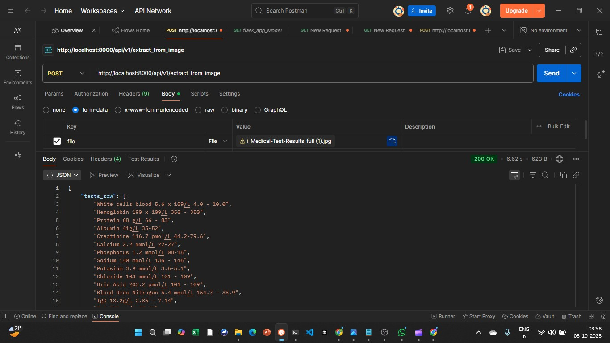
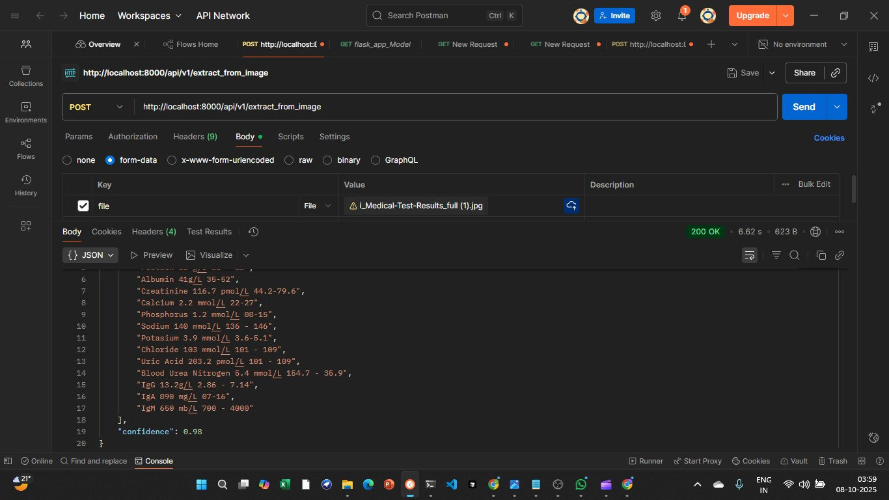


### Normalization Endpoint (/normalize)
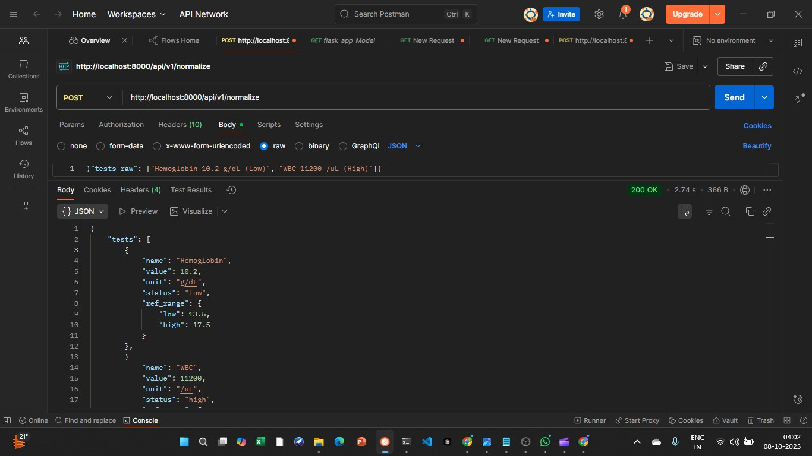
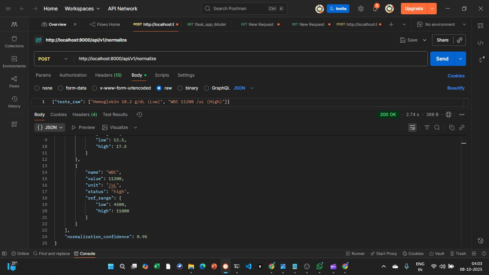

### Summarization Endpoint (/summarize)
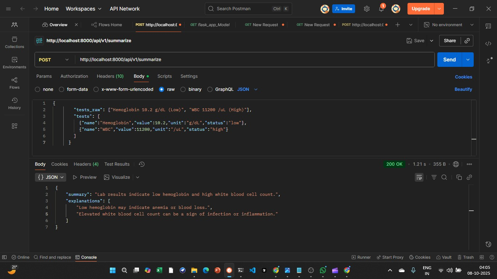

### Full Pipeline - Process from Text (/process_report_from_text)
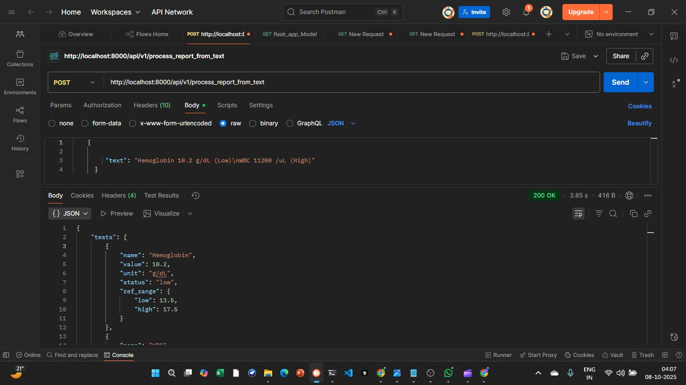
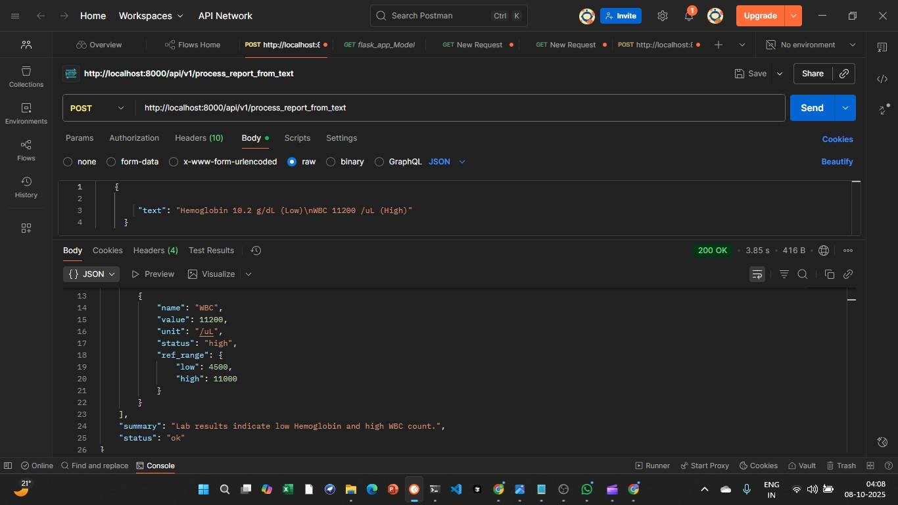

### Full Pipeline - Process from Image (/process_report_from_image)
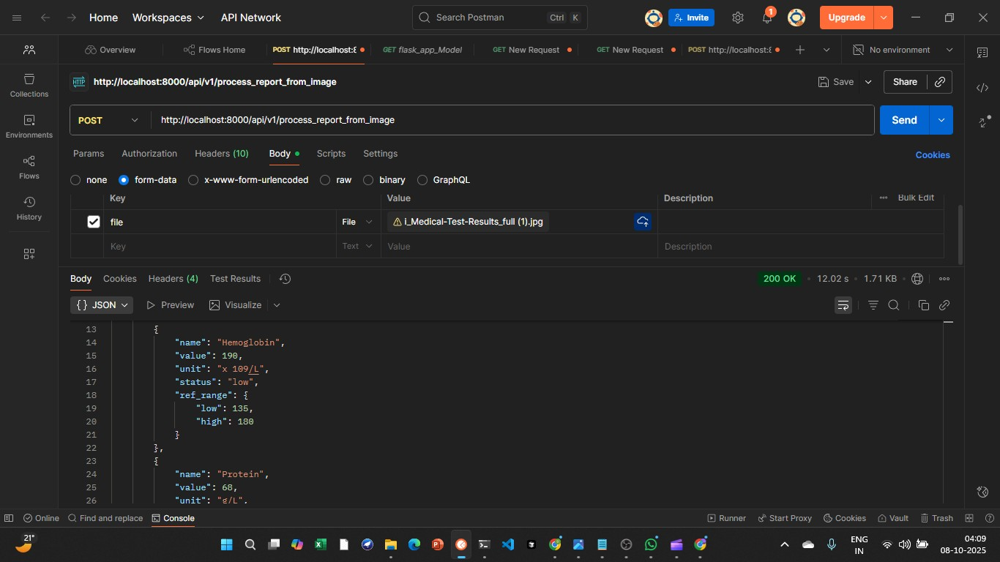
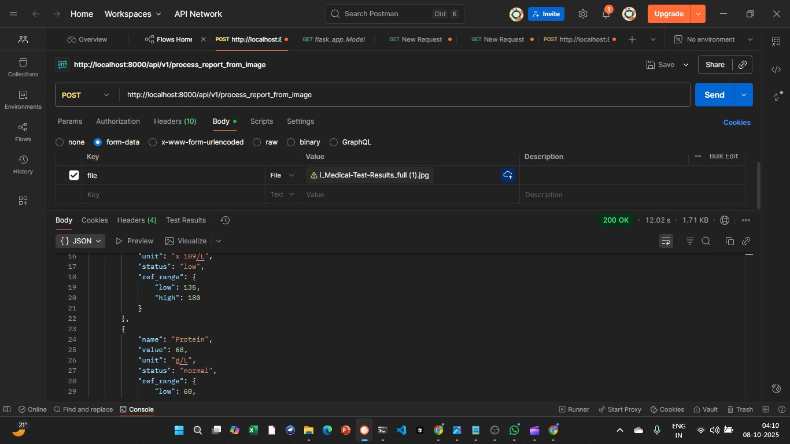
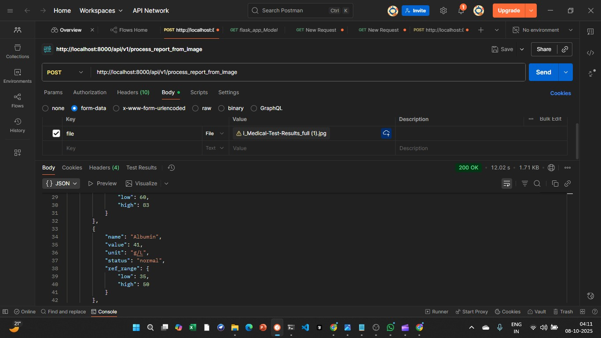
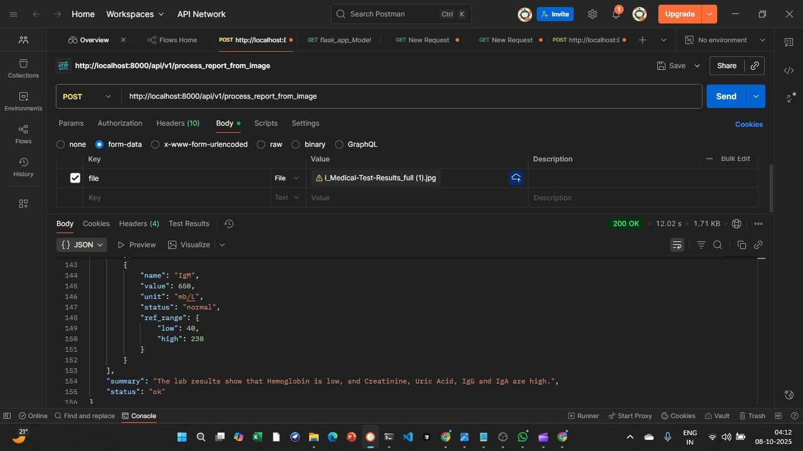
-----

## Development

### Linting/Formatting

Use your preferred linters/formatters. Ensure imports and types are clean.

### Running tests

If/when tests are added, run via `pytest`.

# Potential Improvements

This project provides a solid foundation for a medical report simplifier. Here are some potential features and enhancements that could be added in the future:

* **Enhanced OCR Accuracy**
    Integrate a more advanced, cloud-based OCR service like **Google Cloud Vision** or **AWS Textract**. These services are often more accurate than Tesseract, especially for documents with complex layouts or handwriting.

* **Asynchronous Task Processing**
    For large reports or slow OCR jobs, the current synchronous API endpoints could time out. Implementing a task queue like `Celery` with a message broker (e.g., `Redis` or `RabbitMQ`) would allow for asynchronous background processing. The API could immediately return a `job_id`, and the user could poll a status endpoint to get the results later.

* **Database Integration**
    Add a database (e.g., `PostgreSQL` with `SQLAlchemy`) to store user information, upload history, and the processed results. This would allow users to view their past reports.

* **User Authentication**
    Implement an authentication system (e.g., `OAuth2` with `JWT` tokens) to secure the API, manage users, and ensure that medical data remains private.

* **Comprehensive Test Suite**
    Develop a full suite of unit and integration tests using a framework like `pytest`. This would ensure the reliability of the services and endpoints as the application grows.

* **Advanced Data Extraction**
    For extremely varied or complex report formats, the prompt-based extraction could be supplemented by training a custom **Named Entity Recognition (NER)** model to more reliably identify test names, values, and units from unstructured text.

* **Frontend Application**
    Build a user-friendly frontend using a framework like **React** or **Vue.js**. This would provide a complete web application where users can create accounts, upload their report files, and view the simplified results in a clean interface.
